This project is available on 
_[github](https://github.com/Lola-san/Cetacean.excretion.global.git)_

# Relative composition of poop 

Table with stat, no normalization : 
<table class="table" style="margin-left: auto; margin-right: auto;">
 <thead>
  <tr>
   <th style="text-align:center;"> Eco_gp </th>
   <th style="text-align:center;"> Element </th>
   <th style="text-align:center;"> min </th>
   <th style="text-align:center;"> 2.5_quant </th>
   <th style="text-align:center;"> mean </th>
   <th style="text-align:center;"> median </th>
   <th style="text-align:center;"> 97.5_quant </th>
   <th style="text-align:center;"> max </th>
  </tr>
 </thead>
<tbody>
  <tr>
   <td style="text-align:center;"> Baleen whales </td>
   <td style="text-align:center;"> N </td>
   <td style="text-align:center;"> 4803.5292773 </td>
   <td style="text-align:center;"> 13087.7704543 </td>
   <td style="text-align:center;"> 20684.4940461 </td>
   <td style="text-align:center;"> 20731.0480168 </td>
   <td style="text-align:center;"> 27675.1298830 </td>
   <td style="text-align:center;"> 37016.3268343 </td>
  </tr>
  <tr>
   <td style="text-align:center;"> Baleen whales </td>
   <td style="text-align:center;"> P </td>
   <td style="text-align:center;"> 522.8267437 </td>
   <td style="text-align:center;"> 1271.1538648 </td>
   <td style="text-align:center;"> 2301.0366583 </td>
   <td style="text-align:center;"> 2256.7483173 </td>
   <td style="text-align:center;"> 3572.9566586 </td>
   <td style="text-align:center;"> 4736.1622718 </td>
  </tr>
  <tr>
   <td style="text-align:center;"> Baleen whales </td>
   <td style="text-align:center;"> Fe </td>
   <td style="text-align:center;"> 2.4224797 </td>
   <td style="text-align:center;"> 5.3967575 </td>
   <td style="text-align:center;"> 15.5733882 </td>
   <td style="text-align:center;"> 15.1758103 </td>
   <td style="text-align:center;"> 28.5505522 </td>
   <td style="text-align:center;"> 37.0809946 </td>
  </tr>
  <tr>
   <td style="text-align:center;"> Baleen whales </td>
   <td style="text-align:center;"> Cu </td>
   <td style="text-align:center;"> 0.2025818 </td>
   <td style="text-align:center;"> 0.5588855 </td>
   <td style="text-align:center;"> 2.8931211 </td>
   <td style="text-align:center;"> 2.6223706 </td>
   <td style="text-align:center;"> 6.9851905 </td>
   <td style="text-align:center;"> 11.2713267 </td>
  </tr>
  <tr>
   <td style="text-align:center;"> Baleen whales </td>
   <td style="text-align:center;"> Mn </td>
   <td style="text-align:center;"> 0.0659252 </td>
   <td style="text-align:center;"> 0.1315089 </td>
   <td style="text-align:center;"> 0.5427884 </td>
   <td style="text-align:center;"> 0.4330465 </td>
   <td style="text-align:center;"> 1.6835852 </td>
   <td style="text-align:center;"> 2.2261938 </td>
  </tr>
  <tr>
   <td style="text-align:center;"> Baleen whales </td>
   <td style="text-align:center;"> Se </td>
   <td style="text-align:center;"> 0.1015844 </td>
   <td style="text-align:center;"> 0.2142562 </td>
   <td style="text-align:center;"> 0.6110869 </td>
   <td style="text-align:center;"> 0.5678988 </td>
   <td style="text-align:center;"> 1.3125669 </td>
   <td style="text-align:center;"> 2.5209845 </td>
  </tr>
  <tr>
   <td style="text-align:center;"> Baleen whales </td>
   <td style="text-align:center;"> Zn </td>
   <td style="text-align:center;"> 1.9130292 </td>
   <td style="text-align:center;"> 4.2746369 </td>
   <td style="text-align:center;"> 11.9622507 </td>
   <td style="text-align:center;"> 11.5084105 </td>
   <td style="text-align:center;"> 22.2012755 </td>
   <td style="text-align:center;"> 34.5485668 </td>
  </tr>
  <tr>
   <td style="text-align:center;"> Baleen whales </td>
   <td style="text-align:center;"> Co </td>
   <td style="text-align:center;"> 0.0030962 </td>
   <td style="text-align:center;"> 0.0062031 </td>
   <td style="text-align:center;"> 0.0182405 </td>
   <td style="text-align:center;"> 0.0173685 </td>
   <td style="text-align:center;"> 0.0369948 </td>
   <td style="text-align:center;"> 0.0615446 </td>
  </tr>
  <tr>
   <td style="text-align:center;"> Baleen whales </td>
   <td style="text-align:center;"> As </td>
   <td style="text-align:center;"> 0.3969022 </td>
   <td style="text-align:center;"> 1.0641356 </td>
   <td style="text-align:center;"> 3.8082265 </td>
   <td style="text-align:center;"> 3.3620493 </td>
   <td style="text-align:center;"> 8.2901297 </td>
   <td style="text-align:center;"> 13.2635738 </td>
  </tr>
  <tr>
   <td style="text-align:center;"> Deep divers </td>
   <td style="text-align:center;"> N </td>
   <td style="text-align:center;"> 15355.9300379 </td>
   <td style="text-align:center;"> 17600.1897487 </td>
   <td style="text-align:center;"> 21294.9916352 </td>
   <td style="text-align:center;"> 21224.5165301 </td>
   <td style="text-align:center;"> 25278.3867518 </td>
   <td style="text-align:center;"> 28376.1621508 </td>
  </tr>
  <tr>
   <td style="text-align:center;"> Deep divers </td>
   <td style="text-align:center;"> P </td>
   <td style="text-align:center;"> 1351.3756070 </td>
   <td style="text-align:center;"> 1515.9876758 </td>
   <td style="text-align:center;"> 1974.6705179 </td>
   <td style="text-align:center;"> 1906.7139674 </td>
   <td style="text-align:center;"> 3083.3633240 </td>
   <td style="text-align:center;"> 4287.9010106 </td>
  </tr>
  <tr>
   <td style="text-align:center;"> Deep divers </td>
   <td style="text-align:center;"> Fe </td>
   <td style="text-align:center;"> 1.8282125 </td>
   <td style="text-align:center;"> 3.7712371 </td>
   <td style="text-align:center;"> 13.7259252 </td>
   <td style="text-align:center;"> 11.1709468 </td>
   <td style="text-align:center;"> 36.3538572 </td>
   <td style="text-align:center;"> 55.8004189 </td>
  </tr>
  <tr>
   <td style="text-align:center;"> Deep divers </td>
   <td style="text-align:center;"> Cu </td>
   <td style="text-align:center;"> 1.1599674 </td>
   <td style="text-align:center;"> 2.5852934 </td>
   <td style="text-align:center;"> 9.4777832 </td>
   <td style="text-align:center;"> 8.7503449 </td>
   <td style="text-align:center;"> 18.4891907 </td>
   <td style="text-align:center;"> 25.5200149 </td>
  </tr>
  <tr>
   <td style="text-align:center;"> Deep divers </td>
   <td style="text-align:center;"> Mn </td>
   <td style="text-align:center;"> 0.1601103 </td>
   <td style="text-align:center;"> 0.2093564 </td>
   <td style="text-align:center;"> 0.4367738 </td>
   <td style="text-align:center;"> 0.3812758 </td>
   <td style="text-align:center;"> 1.0105669 </td>
   <td style="text-align:center;"> 2.0665750 </td>
  </tr>
  <tr>
   <td style="text-align:center;"> Deep divers </td>
   <td style="text-align:center;"> Se </td>
   <td style="text-align:center;"> 0.2735819 </td>
   <td style="text-align:center;"> 0.3600679 </td>
   <td style="text-align:center;"> 0.5711218 </td>
   <td style="text-align:center;"> 0.5462042 </td>
   <td style="text-align:center;"> 0.9097793 </td>
   <td style="text-align:center;"> 1.2166183 </td>
  </tr>
  <tr>
   <td style="text-align:center;"> Deep divers </td>
   <td style="text-align:center;"> Zn </td>
   <td style="text-align:center;"> 6.6002535 </td>
   <td style="text-align:center;"> 9.3671678 </td>
   <td style="text-align:center;"> 13.3496894 </td>
   <td style="text-align:center;"> 13.1578633 </td>
   <td style="text-align:center;"> 18.3863428 </td>
   <td style="text-align:center;"> 24.9015182 </td>
  </tr>
  <tr>
   <td style="text-align:center;"> Deep divers </td>
   <td style="text-align:center;"> Co </td>
   <td style="text-align:center;"> 0.0032392 </td>
   <td style="text-align:center;"> 0.0056598 </td>
   <td style="text-align:center;"> 0.0261080 </td>
   <td style="text-align:center;"> 0.0189089 </td>
   <td style="text-align:center;"> 0.0809571 </td>
   <td style="text-align:center;"> 0.1677464 </td>
  </tr>
  <tr>
   <td style="text-align:center;"> Deep divers </td>
   <td style="text-align:center;"> As </td>
   <td style="text-align:center;"> 1.3910743 </td>
   <td style="text-align:center;"> 2.2790325 </td>
   <td style="text-align:center;"> 4.9771454 </td>
   <td style="text-align:center;"> 4.3836668 </td>
   <td style="text-align:center;"> 11.6917553 </td>
   <td style="text-align:center;"> 36.6688351 </td>
  </tr>
  <tr>
   <td style="text-align:center;"> Small delphinids </td>
   <td style="text-align:center;"> N </td>
   <td style="text-align:center;"> 13679.9341631 </td>
   <td style="text-align:center;"> 17553.8955273 </td>
   <td style="text-align:center;"> 21476.5564209 </td>
   <td style="text-align:center;"> 21397.8761326 </td>
   <td style="text-align:center;"> 25863.2998350 </td>
   <td style="text-align:center;"> 31184.7842972 </td>
  </tr>
  <tr>
   <td style="text-align:center;"> Small delphinids </td>
   <td style="text-align:center;"> P </td>
   <td style="text-align:center;"> 1221.6840376 </td>
   <td style="text-align:center;"> 1721.4438781 </td>
   <td style="text-align:center;"> 2496.3514769 </td>
   <td style="text-align:center;"> 2428.4369045 </td>
   <td style="text-align:center;"> 3631.6911892 </td>
   <td style="text-align:center;"> 6357.9785878 </td>
  </tr>
  <tr>
   <td style="text-align:center;"> Small delphinids </td>
   <td style="text-align:center;"> Fe </td>
   <td style="text-align:center;"> 2.8945579 </td>
   <td style="text-align:center;"> 6.8580852 </td>
   <td style="text-align:center;"> 15.7062286 </td>
   <td style="text-align:center;"> 14.5890452 </td>
   <td style="text-align:center;"> 30.3742002 </td>
   <td style="text-align:center;"> 47.5093362 </td>
  </tr>
  <tr>
   <td style="text-align:center;"> Small delphinids </td>
   <td style="text-align:center;"> Cu </td>
   <td style="text-align:center;"> 0.2720493 </td>
   <td style="text-align:center;"> 0.5929342 </td>
   <td style="text-align:center;"> 3.4662012 </td>
   <td style="text-align:center;"> 2.4141602 </td>
   <td style="text-align:center;"> 10.6007151 </td>
   <td style="text-align:center;"> 19.1384624 </td>
  </tr>
  <tr>
   <td style="text-align:center;"> Small delphinids </td>
   <td style="text-align:center;"> Mn </td>
   <td style="text-align:center;"> 0.0906641 </td>
   <td style="text-align:center;"> 0.2315346 </td>
   <td style="text-align:center;"> 0.6488417 </td>
   <td style="text-align:center;"> 0.5775614 </td>
   <td style="text-align:center;"> 1.4540424 </td>
   <td style="text-align:center;"> 2.8626562 </td>
  </tr>
  <tr>
   <td style="text-align:center;"> Small delphinids </td>
   <td style="text-align:center;"> Se </td>
   <td style="text-align:center;"> 0.1854777 </td>
   <td style="text-align:center;"> 0.3288976 </td>
   <td style="text-align:center;"> 0.5756941 </td>
   <td style="text-align:center;"> 0.5421287 </td>
   <td style="text-align:center;"> 1.0400304 </td>
   <td style="text-align:center;"> 2.4229266 </td>
  </tr>
  <tr>
   <td style="text-align:center;"> Small delphinids </td>
   <td style="text-align:center;"> Zn </td>
   <td style="text-align:center;"> 4.7274184 </td>
   <td style="text-align:center;"> 6.9321688 </td>
   <td style="text-align:center;"> 11.7436676 </td>
   <td style="text-align:center;"> 11.3673795 </td>
   <td style="text-align:center;"> 18.8987526 </td>
   <td style="text-align:center;"> 34.1233559 </td>
  </tr>
  <tr>
   <td style="text-align:center;"> Small delphinids </td>
   <td style="text-align:center;"> Co </td>
   <td style="text-align:center;"> 0.0037840 </td>
   <td style="text-align:center;"> 0.0074276 </td>
   <td style="text-align:center;"> 0.0203580 </td>
   <td style="text-align:center;"> 0.0173736 </td>
   <td style="text-align:center;"> 0.0526938 </td>
   <td style="text-align:center;"> 0.1086769 </td>
  </tr>
  <tr>
   <td style="text-align:center;"> Small delphinids </td>
   <td style="text-align:center;"> As </td>
   <td style="text-align:center;"> 0.4632136 </td>
   <td style="text-align:center;"> 1.5533182 </td>
   <td style="text-align:center;"> 4.4699661 </td>
   <td style="text-align:center;"> 3.6435987 </td>
   <td style="text-align:center;"> 12.7223892 </td>
   <td style="text-align:center;"> 37.5292328 </td>
  </tr>
</tbody>
</table>

And with normalization: 

<table class="table" style="margin-left: auto; margin-right: auto;">
 <thead>
  <tr>
   <th style="text-align:center;"> Eco_gp </th>
   <th style="text-align:center;"> Element </th>
   <th style="text-align:center;"> min </th>
   <th style="text-align:center;"> 2.5_quant </th>
   <th style="text-align:center;"> 10_quant </th>
   <th style="text-align:center;"> mean </th>
   <th style="text-align:center;"> median </th>
   <th style="text-align:center;"> 90_quant </th>
   <th style="text-align:center;"> 97.5_quant </th>
   <th style="text-align:center;"> max </th>
  </tr>
 </thead>
<tbody>
  <tr>
   <td style="text-align:center;"> Baleen whales </td>
   <td style="text-align:center;"> N </td>
   <td style="text-align:center;"> 0.0000000 </td>
   <td style="text-align:center;"> 0.2571724 </td>
   <td style="text-align:center;"> 0.3497237 </td>
   <td style="text-align:center;"> 0.4930017 </td>
   <td style="text-align:center;"> 0.4944469 </td>
   <td style="text-align:center;"> 0.6347161 </td>
   <td style="text-align:center;"> 0.7100160 </td>
   <td style="text-align:center;"> 1.0000000 </td>
  </tr>
  <tr>
   <td style="text-align:center;"> Baleen whales </td>
   <td style="text-align:center;"> P </td>
   <td style="text-align:center;"> 0.0000000 </td>
   <td style="text-align:center;"> 0.1282447 </td>
   <td style="text-align:center;"> 0.1838599 </td>
   <td style="text-align:center;"> 0.3047410 </td>
   <td style="text-align:center;"> 0.2971511 </td>
   <td style="text-align:center;"> 0.4358684 </td>
   <td style="text-align:center;"> 0.5227165 </td>
   <td style="text-align:center;"> 0.7220610 </td>
  </tr>
  <tr>
   <td style="text-align:center;"> Baleen whales </td>
   <td style="text-align:center;"> Fe </td>
   <td style="text-align:center;"> 0.0110106 </td>
   <td style="text-align:center;"> 0.0661182 </td>
   <td style="text-align:center;"> 0.1205690 </td>
   <td style="text-align:center;"> 0.2546714 </td>
   <td style="text-align:center;"> 0.2473050 </td>
   <td style="text-align:center;"> 0.3971415 </td>
   <td style="text-align:center;"> 0.4951130 </td>
   <td style="text-align:center;"> 0.6531655 </td>
  </tr>
  <tr>
   <td style="text-align:center;"> Baleen whales </td>
   <td style="text-align:center;"> Cu </td>
   <td style="text-align:center;"> 0.0000000 </td>
   <td style="text-align:center;"> 0.0140735 </td>
   <td style="text-align:center;"> 0.0232201 </td>
   <td style="text-align:center;"> 0.1062722 </td>
   <td style="text-align:center;"> 0.0955780 </td>
   <td style="text-align:center;"> 0.2137475 </td>
   <td style="text-align:center;"> 0.2679027 </td>
   <td style="text-align:center;"> 0.4371985 </td>
  </tr>
  <tr>
   <td style="text-align:center;"> Baleen whales </td>
   <td style="text-align:center;"> Mn </td>
   <td style="text-align:center;"> 0.0000000 </td>
   <td style="text-align:center;"> 0.0234501 </td>
   <td style="text-align:center;"> 0.0513397 </td>
   <td style="text-align:center;"> 0.1705073 </td>
   <td style="text-align:center;"> 0.1312680 </td>
   <td style="text-align:center;"> 0.3626263 </td>
   <td style="text-align:center;"> 0.5784110 </td>
   <td style="text-align:center;"> 0.7724263 </td>
  </tr>
  <tr>
   <td style="text-align:center;"> Baleen whales </td>
   <td style="text-align:center;"> Se </td>
   <td style="text-align:center;"> 0.0000000 </td>
   <td style="text-align:center;"> 0.0465702 </td>
   <td style="text-align:center;"> 0.0885898 </td>
   <td style="text-align:center;"> 0.2105904 </td>
   <td style="text-align:center;"> 0.1927397 </td>
   <td style="text-align:center;"> 0.3439593 </td>
   <td style="text-align:center;"> 0.5005301 </td>
   <td style="text-align:center;"> 1.0000000 </td>
  </tr>
  <tr>
   <td style="text-align:center;"> Baleen whales </td>
   <td style="text-align:center;"> Zn </td>
   <td style="text-align:center;"> 0.0000000 </td>
   <td style="text-align:center;"> 0.0723631 </td>
   <td style="text-align:center;"> 0.1407823 </td>
   <td style="text-align:center;"> 0.3079227 </td>
   <td style="text-align:center;"> 0.2940163 </td>
   <td style="text-align:center;"> 0.4898783 </td>
   <td style="text-align:center;"> 0.6216612 </td>
   <td style="text-align:center;"> 1.0000000 </td>
  </tr>
  <tr>
   <td style="text-align:center;"> Baleen whales </td>
   <td style="text-align:center;"> Co </td>
   <td style="text-align:center;"> 0.0000000 </td>
   <td style="text-align:center;"> 0.0188698 </td>
   <td style="text-align:center;"> 0.0353615 </td>
   <td style="text-align:center;"> 0.0919789 </td>
   <td style="text-align:center;"> 0.0866825 </td>
   <td style="text-align:center;"> 0.1501939 </td>
   <td style="text-align:center;"> 0.2058826 </td>
   <td style="text-align:center;"> 0.3549858 </td>
  </tr>
  <tr>
   <td style="text-align:center;"> Baleen whales </td>
   <td style="text-align:center;"> As </td>
   <td style="text-align:center;"> 0.0000000 </td>
   <td style="text-align:center;"> 0.0179691 </td>
   <td style="text-align:center;"> 0.0311727 </td>
   <td style="text-align:center;"> 0.0918694 </td>
   <td style="text-align:center;"> 0.0798535 </td>
   <td style="text-align:center;"> 0.1701962 </td>
   <td style="text-align:center;"> 0.2125702 </td>
   <td style="text-align:center;"> 0.3465086 </td>
  </tr>
  <tr>
   <td style="text-align:center;"> Deep divers </td>
   <td style="text-align:center;"> N </td>
   <td style="text-align:center;"> 0.3275841 </td>
   <td style="text-align:center;"> 0.3972539 </td>
   <td style="text-align:center;"> 0.4303498 </td>
   <td style="text-align:center;"> 0.5119537 </td>
   <td style="text-align:center;"> 0.5097659 </td>
   <td style="text-align:center;"> 0.5976566 </td>
   <td style="text-align:center;"> 0.6356125 </td>
   <td style="text-align:center;"> 0.7317785 </td>
  </tr>
  <tr>
   <td style="text-align:center;"> Deep divers </td>
   <td style="text-align:center;"> P </td>
   <td style="text-align:center;"> 0.1419927 </td>
   <td style="text-align:center;"> 0.1702031 </td>
   <td style="text-align:center;"> 0.1886504 </td>
   <td style="text-align:center;"> 0.2488099 </td>
   <td style="text-align:center;"> 0.2371639 </td>
   <td style="text-align:center;"> 0.3110471 </td>
   <td style="text-align:center;"> 0.4388123 </td>
   <td style="text-align:center;"> 0.6452402 </td>
  </tr>
  <tr>
   <td style="text-align:center;"> Deep divers </td>
   <td style="text-align:center;"> Fe </td>
   <td style="text-align:center;"> 0.0000000 </td>
   <td style="text-align:center;"> 0.0360005 </td>
   <td style="text-align:center;"> 0.0696405 </td>
   <td style="text-align:center;"> 0.2204415 </td>
   <td style="text-align:center;"> 0.1731027 </td>
   <td style="text-align:center;"> 0.4628030 </td>
   <td style="text-align:center;"> 0.6396930 </td>
   <td style="text-align:center;"> 1.0000000 </td>
  </tr>
  <tr>
   <td style="text-align:center;"> Deep divers </td>
   <td style="text-align:center;"> Cu </td>
   <td style="text-align:center;"> 0.0378153 </td>
   <td style="text-align:center;"> 0.0941135 </td>
   <td style="text-align:center;"> 0.1650769 </td>
   <td style="text-align:center;"> 0.3663563 </td>
   <td style="text-align:center;"> 0.3376236 </td>
   <td style="text-align:center;"> 0.6156000 </td>
   <td style="text-align:center;"> 0.7222932 </td>
   <td style="text-align:center;"> 1.0000000 </td>
  </tr>
  <tr>
   <td style="text-align:center;"> Deep divers </td>
   <td style="text-align:center;"> Mn </td>
   <td style="text-align:center;"> 0.0336768 </td>
   <td style="text-align:center;"> 0.0512853 </td>
   <td style="text-align:center;"> 0.0656439 </td>
   <td style="text-align:center;"> 0.1326007 </td>
   <td style="text-align:center;"> 0.1127569 </td>
   <td style="text-align:center;"> 0.2122556 </td>
   <td style="text-align:center;"> 0.3377664 </td>
   <td style="text-align:center;"> 0.7153529 </td>
  </tr>
  <tr>
   <td style="text-align:center;"> Deep divers </td>
   <td style="text-align:center;"> Se </td>
   <td style="text-align:center;"> 0.0710910 </td>
   <td style="text-align:center;"> 0.1068379 </td>
   <td style="text-align:center;"> 0.1290881 </td>
   <td style="text-align:center;"> 0.1940718 </td>
   <td style="text-align:center;"> 0.1837727 </td>
   <td style="text-align:center;"> 0.2786826 </td>
   <td style="text-align:center;"> 0.3340476 </td>
   <td style="text-align:center;"> 0.4608721 </td>
  </tr>
  <tr>
   <td style="text-align:center;"> Deep divers </td>
   <td style="text-align:center;"> Zn </td>
   <td style="text-align:center;"> 0.1436233 </td>
   <td style="text-align:center;"> 0.2284056 </td>
   <td style="text-align:center;"> 0.2638741 </td>
   <td style="text-align:center;"> 0.3504358 </td>
   <td style="text-align:center;"> 0.3445580 </td>
   <td style="text-align:center;"> 0.4431413 </td>
   <td style="text-align:center;"> 0.5047661 </td>
   <td style="text-align:center;"> 0.7044005 </td>
  </tr>
  <tr>
   <td style="text-align:center;"> Deep divers </td>
   <td style="text-align:center;"> Co </td>
   <td style="text-align:center;"> 0.0008687 </td>
   <td style="text-align:center;"> 0.0155702 </td>
   <td style="text-align:center;"> 0.0302018 </td>
   <td style="text-align:center;"> 0.1397618 </td>
   <td style="text-align:center;"> 0.0960386 </td>
   <td style="text-align:center;"> 0.2979362 </td>
   <td style="text-align:center;"> 0.4728873 </td>
   <td style="text-align:center;"> 1.0000000 </td>
  </tr>
  <tr>
   <td style="text-align:center;"> Deep divers </td>
   <td style="text-align:center;"> As </td>
   <td style="text-align:center;"> 0.0267738 </td>
   <td style="text-align:center;"> 0.0506871 </td>
   <td style="text-align:center;"> 0.0644692 </td>
   <td style="text-align:center;"> 0.1233492 </td>
   <td style="text-align:center;"> 0.1073664 </td>
   <td style="text-align:center;"> 0.1855648 </td>
   <td style="text-align:center;"> 0.3041784 </td>
   <td style="text-align:center;"> 0.9768289 </td>
  </tr>
  <tr>
   <td style="text-align:center;"> Small delphinids </td>
   <td style="text-align:center;"> N </td>
   <td style="text-align:center;"> 0.2755552 </td>
   <td style="text-align:center;"> 0.3958168 </td>
   <td style="text-align:center;"> 0.4327413 </td>
   <td style="text-align:center;"> 0.5175902 </td>
   <td style="text-align:center;"> 0.5151476 </td>
   <td style="text-align:center;"> 0.6060107 </td>
   <td style="text-align:center;"> 0.6537703 </td>
   <td style="text-align:center;"> 0.8189681 </td>
  </tr>
  <tr>
   <td style="text-align:center;"> Small delphinids </td>
   <td style="text-align:center;"> P </td>
   <td style="text-align:center;"> 0.1197668 </td>
   <td style="text-align:center;"> 0.2054132 </td>
   <td style="text-align:center;"> 0.2419437 </td>
   <td style="text-align:center;"> 0.3382131 </td>
   <td style="text-align:center;"> 0.3265742 </td>
   <td style="text-align:center;"> 0.4482132 </td>
   <td style="text-align:center;"> 0.5327821 </td>
   <td style="text-align:center;"> 1.0000000 </td>
  </tr>
  <tr>
   <td style="text-align:center;"> Small delphinids </td>
   <td style="text-align:center;"> Fe </td>
   <td style="text-align:center;"> 0.0197573 </td>
   <td style="text-align:center;"> 0.0931938 </td>
   <td style="text-align:center;"> 0.1316344 </td>
   <td style="text-align:center;"> 0.2571326 </td>
   <td style="text-align:center;"> 0.2364334 </td>
   <td style="text-align:center;"> 0.4147008 </td>
   <td style="text-align:center;"> 0.5289016 </td>
   <td style="text-align:center;"> 0.8463824 </td>
  </tr>
  <tr>
   <td style="text-align:center;"> Small delphinids </td>
   <td style="text-align:center;"> Cu </td>
   <td style="text-align:center;"> 0.0027439 </td>
   <td style="text-align:center;"> 0.0154183 </td>
   <td style="text-align:center;"> 0.0224022 </td>
   <td style="text-align:center;"> 0.1289080 </td>
   <td style="text-align:center;"> 0.0873540 </td>
   <td style="text-align:center;"> 0.2982493 </td>
   <td style="text-align:center;"> 0.4107104 </td>
   <td style="text-align:center;"> 0.7479384 </td>
  </tr>
  <tr>
   <td style="text-align:center;"> Small delphinids </td>
   <td style="text-align:center;"> Mn </td>
   <td style="text-align:center;"> 0.0088457 </td>
   <td style="text-align:center;"> 0.0592153 </td>
   <td style="text-align:center;"> 0.0888520 </td>
   <td style="text-align:center;"> 0.2084278 </td>
   <td style="text-align:center;"> 0.1829408 </td>
   <td style="text-align:center;"> 0.3628433 </td>
   <td style="text-align:center;"> 0.4963356 </td>
   <td style="text-align:center;"> 1.0000000 </td>
  </tr>
  <tr>
   <td style="text-align:center;"> Small delphinids </td>
   <td style="text-align:center;"> Se </td>
   <td style="text-align:center;"> 0.0346753 </td>
   <td style="text-align:center;"> 0.0939544 </td>
   <td style="text-align:center;"> 0.1223297 </td>
   <td style="text-align:center;"> 0.1959617 </td>
   <td style="text-align:center;"> 0.1820883 </td>
   <td style="text-align:center;"> 0.2811983 </td>
   <td style="text-align:center;"> 0.3878838 </td>
   <td style="text-align:center;"> 0.9594702 </td>
  </tr>
  <tr>
   <td style="text-align:center;"> Small delphinids </td>
   <td style="text-align:center;"> Zn </td>
   <td style="text-align:center;"> 0.0862369 </td>
   <td style="text-align:center;"> 0.1537937 </td>
   <td style="text-align:center;"> 0.1916451 </td>
   <td style="text-align:center;"> 0.3012250 </td>
   <td style="text-align:center;"> 0.2896949 </td>
   <td style="text-align:center;"> 0.4225462 </td>
   <td style="text-align:center;"> 0.5204671 </td>
   <td style="text-align:center;"> 0.9869709 </td>
  </tr>
  <tr>
   <td style="text-align:center;"> Small delphinids </td>
   <td style="text-align:center;"> Co </td>
   <td style="text-align:center;"> 0.0041777 </td>
   <td style="text-align:center;"> 0.0263069 </td>
   <td style="text-align:center;"> 0.0434439 </td>
   <td style="text-align:center;"> 0.1048395 </td>
   <td style="text-align:center;"> 0.0867137 </td>
   <td style="text-align:center;"> 0.1791315 </td>
   <td style="text-align:center;"> 0.3012302 </td>
   <td style="text-align:center;"> 0.6412430 </td>
  </tr>
  <tr>
   <td style="text-align:center;"> Small delphinids </td>
   <td style="text-align:center;"> As </td>
   <td style="text-align:center;"> 0.0017858 </td>
   <td style="text-align:center;"> 0.0311431 </td>
   <td style="text-align:center;"> 0.0468961 </td>
   <td style="text-align:center;"> 0.1096905 </td>
   <td style="text-align:center;"> 0.0874358 </td>
   <td style="text-align:center;"> 0.1944506 </td>
   <td style="text-align:center;"> 0.3319341 </td>
   <td style="text-align:center;"> 1.0000000 </td>
  </tr>
</tbody>
</table>

Significance of the differences: 
<table class="table" style="margin-left: auto; margin-right: auto;">
 <thead>
  <tr>
   <th style="text-align:center;"> Element </th>
   <th style="text-align:center;"> Group1 </th>
   <th style="text-align:center;"> Group2 </th>
   <th style="text-align:center;"> ratio_group1_superior_to_group2 </th>
  </tr>
 </thead>
<tbody>
  <tr>
   <td style="text-align:center;"> N </td>
   <td style="text-align:center;"> Baleen whales </td>
   <td style="text-align:center;"> Deep divers </td>
   <td style="text-align:center;"> 0.4595 </td>
  </tr>
  <tr>
   <td style="text-align:center;"> N </td>
   <td style="text-align:center;"> Baleen whales </td>
   <td style="text-align:center;"> Small delphinids </td>
   <td style="text-align:center;"> 0.4302 </td>
  </tr>
  <tr>
   <td style="text-align:center;"> N </td>
   <td style="text-align:center;"> Deep divers </td>
   <td style="text-align:center;"> Small delphinids </td>
   <td style="text-align:center;"> 0.5021 </td>
  </tr>
  <tr>
   <td style="text-align:center;"> P </td>
   <td style="text-align:center;"> Baleen whales </td>
   <td style="text-align:center;"> Deep divers </td>
   <td style="text-align:center;"> 0.4749 </td>
  </tr>
  <tr>
   <td style="text-align:center;"> P </td>
   <td style="text-align:center;"> Baleen whales </td>
   <td style="text-align:center;"> Small delphinids </td>
   <td style="text-align:center;"> 0.4379 </td>
  </tr>
  <tr>
   <td style="text-align:center;"> P </td>
   <td style="text-align:center;"> Deep divers </td>
   <td style="text-align:center;"> Small delphinids </td>
   <td style="text-align:center;"> 0.5036 </td>
  </tr>
  <tr>
   <td style="text-align:center;"> Fe </td>
   <td style="text-align:center;"> Baleen whales </td>
   <td style="text-align:center;"> Deep divers </td>
   <td style="text-align:center;"> 0.5947 </td>
  </tr>
  <tr>
   <td style="text-align:center;"> Fe </td>
   <td style="text-align:center;"> Baleen whales </td>
   <td style="text-align:center;"> Small delphinids </td>
   <td style="text-align:center;"> 0.3727 </td>
  </tr>
  <tr>
   <td style="text-align:center;"> Fe </td>
   <td style="text-align:center;"> Deep divers </td>
   <td style="text-align:center;"> Small delphinids </td>
   <td style="text-align:center;"> 0.3752 </td>
  </tr>
  <tr>
   <td style="text-align:center;"> Cu </td>
   <td style="text-align:center;"> Baleen whales </td>
   <td style="text-align:center;"> Deep divers </td>
   <td style="text-align:center;"> 0.0142 </td>
  </tr>
  <tr>
   <td style="text-align:center;"> Cu </td>
   <td style="text-align:center;"> Baleen whales </td>
   <td style="text-align:center;"> Small delphinids </td>
   <td style="text-align:center;"> 0.3775 </td>
  </tr>
  <tr>
   <td style="text-align:center;"> Cu </td>
   <td style="text-align:center;"> Deep divers </td>
   <td style="text-align:center;"> Small delphinids </td>
   <td style="text-align:center;"> 0.9779 </td>
  </tr>
  <tr>
   <td style="text-align:center;"> Mn </td>
   <td style="text-align:center;"> Baleen whales </td>
   <td style="text-align:center;"> Deep divers </td>
   <td style="text-align:center;"> 0.4017 </td>
  </tr>
  <tr>
   <td style="text-align:center;"> Mn </td>
   <td style="text-align:center;"> Baleen whales </td>
   <td style="text-align:center;"> Small delphinids </td>
   <td style="text-align:center;"> 0.4032 </td>
  </tr>
  <tr>
   <td style="text-align:center;"> Mn </td>
   <td style="text-align:center;"> Deep divers </td>
   <td style="text-align:center;"> Small delphinids </td>
   <td style="text-align:center;"> 0.5799 </td>
  </tr>
  <tr>
   <td style="text-align:center;"> Se </td>
   <td style="text-align:center;"> Baleen whales </td>
   <td style="text-align:center;"> Deep divers </td>
   <td style="text-align:center;"> 0.5468 </td>
  </tr>
  <tr>
   <td style="text-align:center;"> Se </td>
   <td style="text-align:center;"> Baleen whales </td>
   <td style="text-align:center;"> Small delphinids </td>
   <td style="text-align:center;"> 0.4130 </td>
  </tr>
  <tr>
   <td style="text-align:center;"> Se </td>
   <td style="text-align:center;"> Deep divers </td>
   <td style="text-align:center;"> Small delphinids </td>
   <td style="text-align:center;"> 0.4288 </td>
  </tr>
  <tr>
   <td style="text-align:center;"> Zn </td>
   <td style="text-align:center;"> Baleen whales </td>
   <td style="text-align:center;"> Deep divers </td>
   <td style="text-align:center;"> 0.6540 </td>
  </tr>
  <tr>
   <td style="text-align:center;"> Zn </td>
   <td style="text-align:center;"> Baleen whales </td>
   <td style="text-align:center;"> Small delphinids </td>
   <td style="text-align:center;"> 0.4267 </td>
  </tr>
  <tr>
   <td style="text-align:center;"> Zn </td>
   <td style="text-align:center;"> Deep divers </td>
   <td style="text-align:center;"> Small delphinids </td>
   <td style="text-align:center;"> 0.3323 </td>
  </tr>
  <tr>
   <td style="text-align:center;"> Co </td>
   <td style="text-align:center;"> Baleen whales </td>
   <td style="text-align:center;"> Deep divers </td>
   <td style="text-align:center;"> 0.4490 </td>
  </tr>
  <tr>
   <td style="text-align:center;"> Co </td>
   <td style="text-align:center;"> Baleen whales </td>
   <td style="text-align:center;"> Small delphinids </td>
   <td style="text-align:center;"> 0.3992 </td>
  </tr>
  <tr>
   <td style="text-align:center;"> Co </td>
   <td style="text-align:center;"> Deep divers </td>
   <td style="text-align:center;"> Small delphinids </td>
   <td style="text-align:center;"> 0.5312 </td>
  </tr>
</tbody>
</table>

Boxplot showing this: 

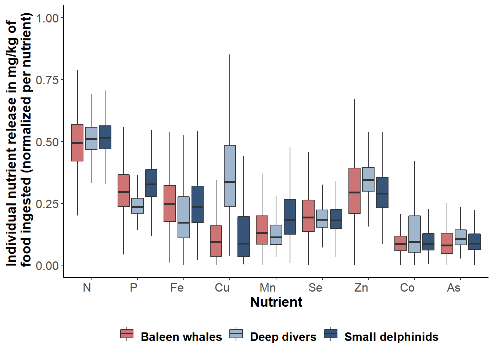

# Relative contribution of taxa in each area 

Northeast Atlantic:
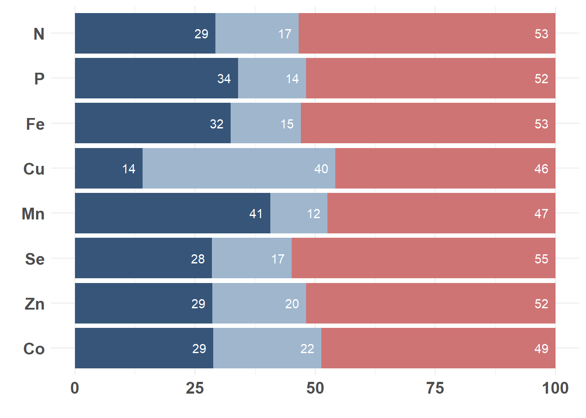

Central North Atlantic:
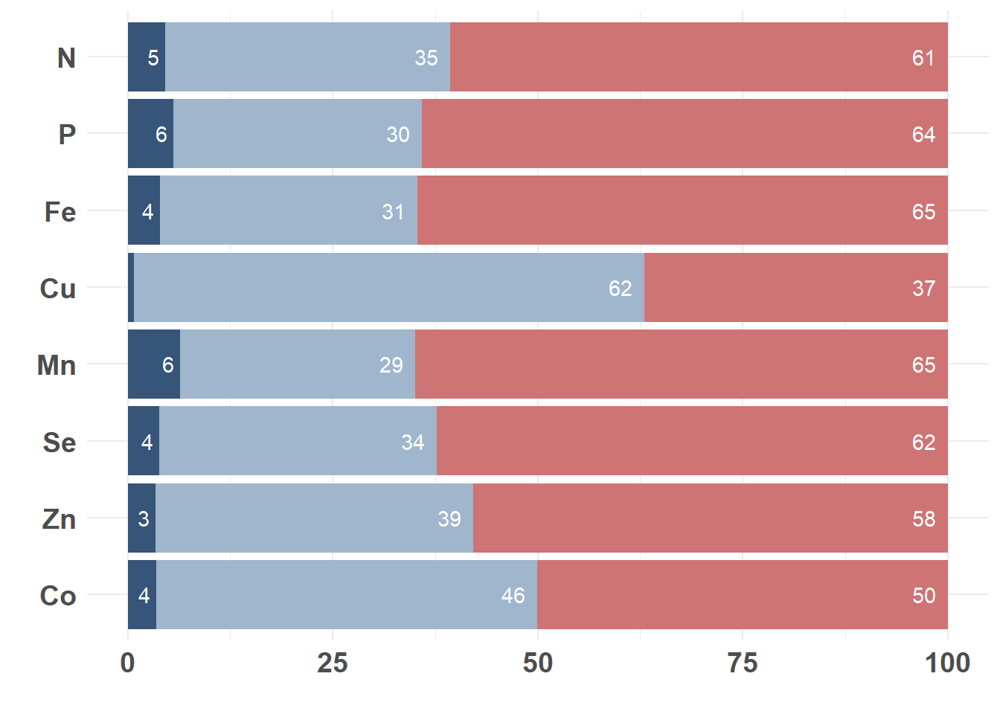

Northwest Atlantic:
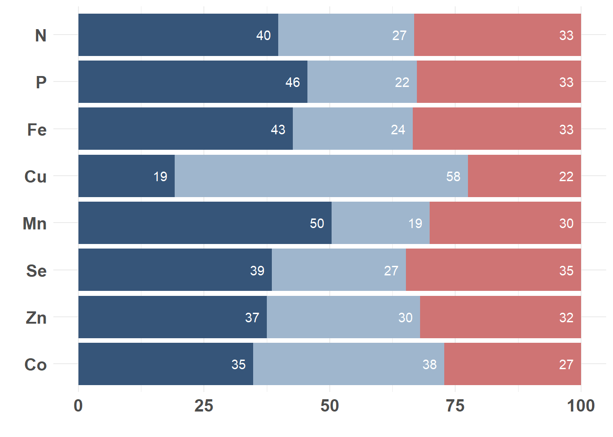

Mediterranean sea:
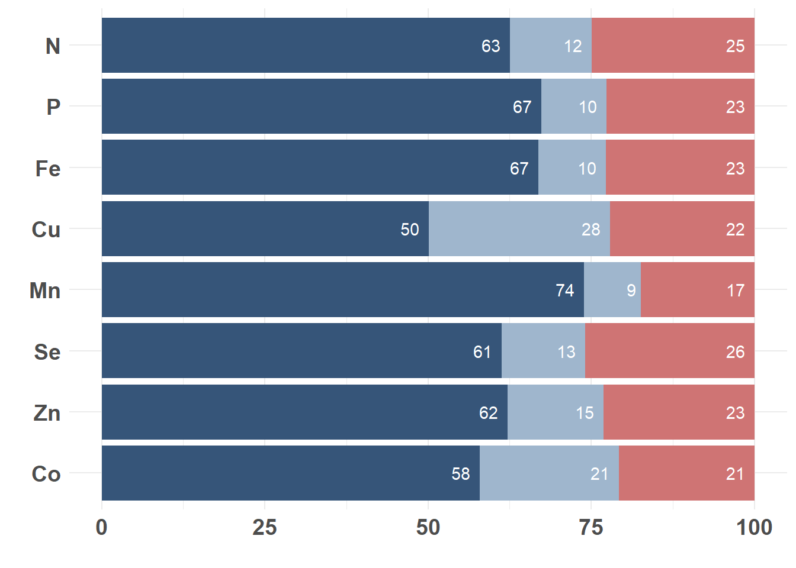

Gulf of Mexico:
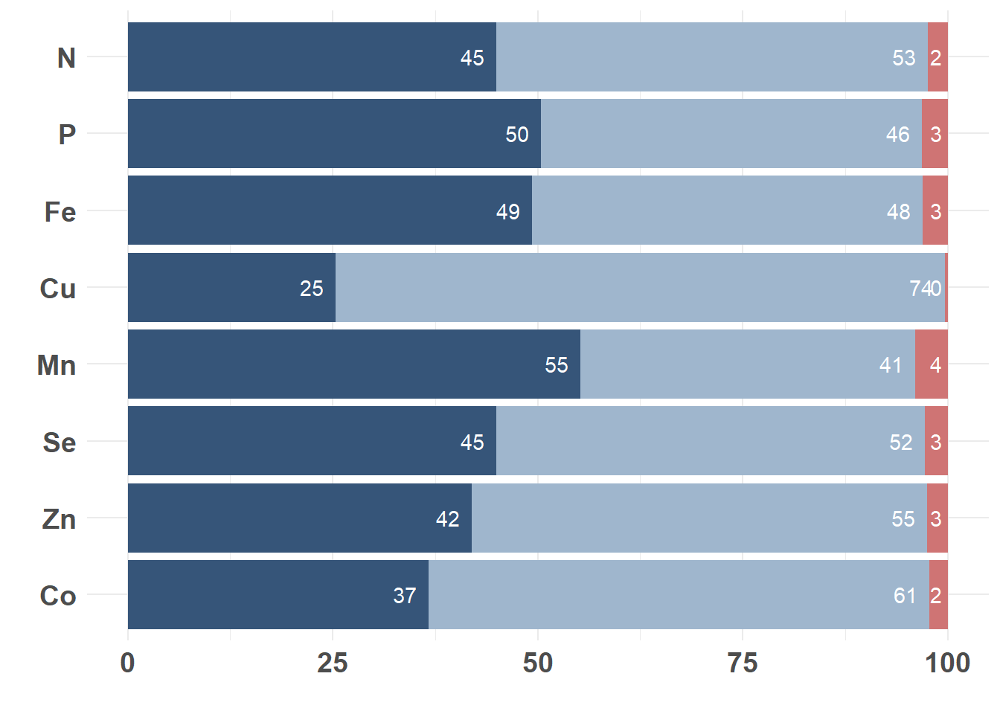

French Antilles:
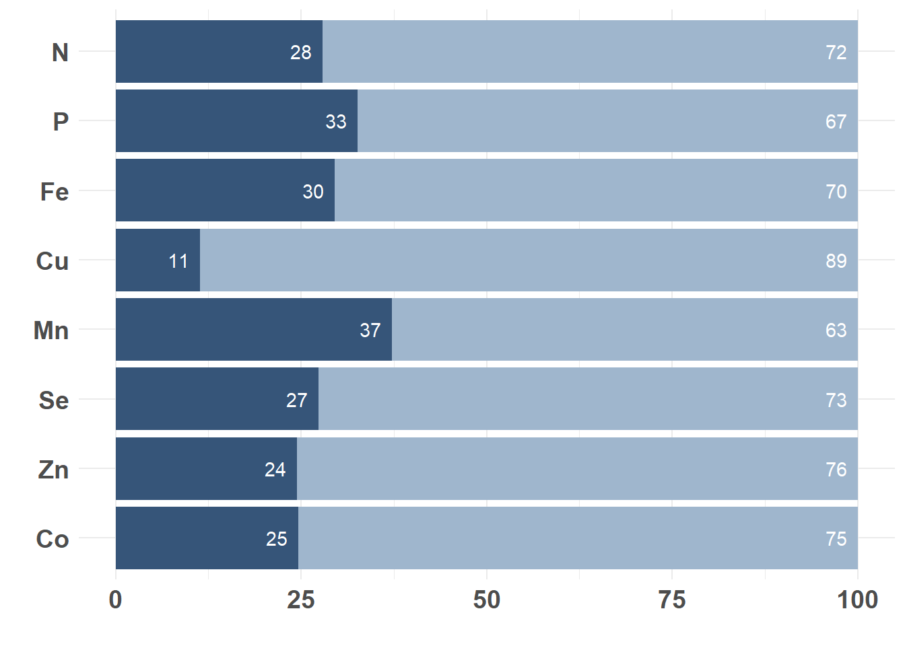

French Guyana:
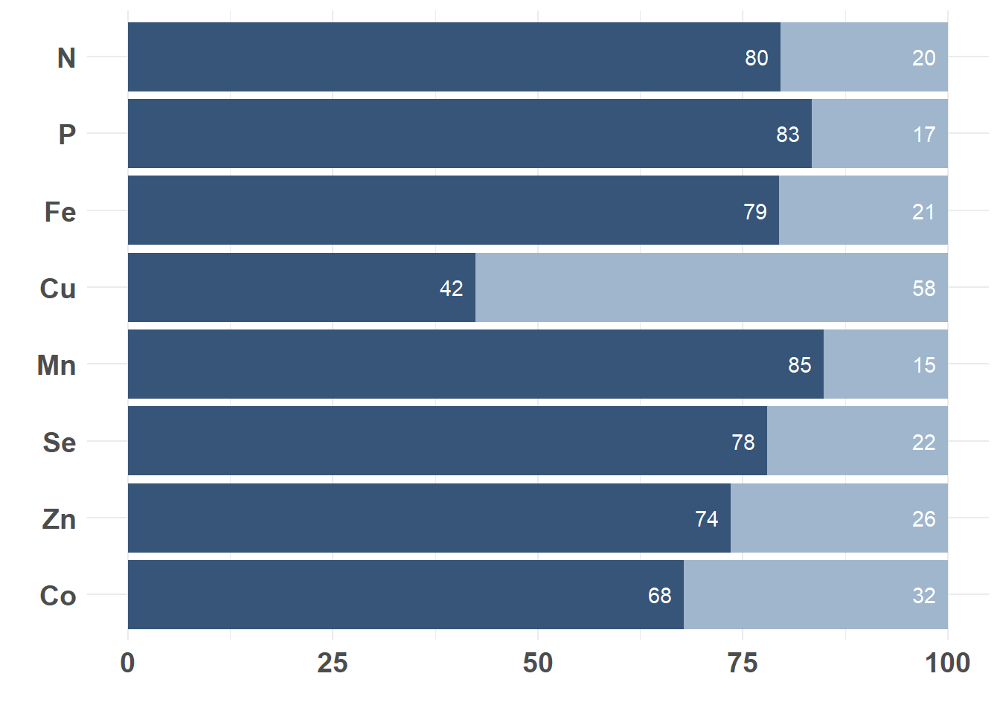

Southwest Indian ocean:

New Caledonia:
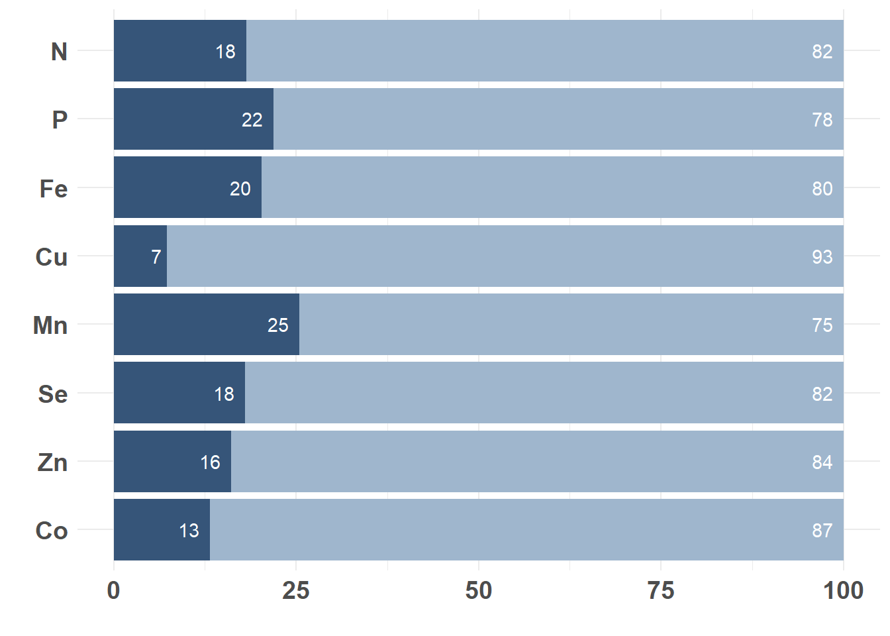

Wallis & Futuna:
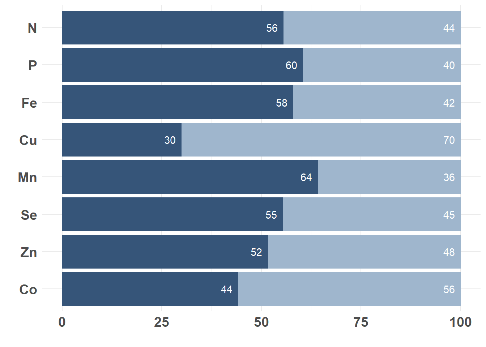

French Polynesia:
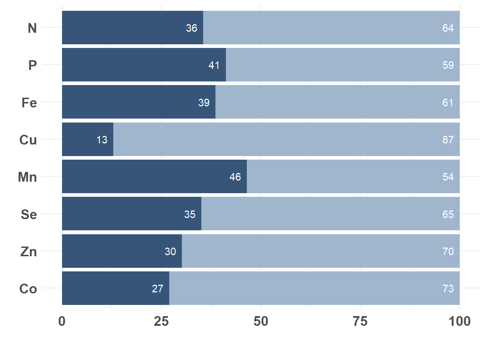

Hawaii:

Gulf of Alaska:
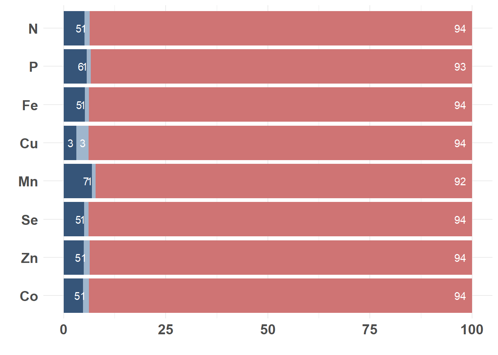

California current:
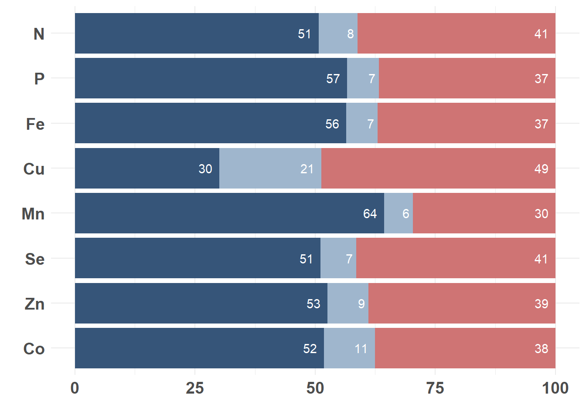
